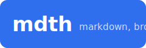

# Welcome 👋

This is a small sample tree so you can see **mdxp** in action. Everything here is
plain Markdown — mdxp renders it live.

## Start here

- Read the [Getting Started guide](guide/getting-started.md).
- See [diagrams with Mermaid](guide/diagrams.md).
- Browse the [API reference](reference/api.md).

## A taste of formatting

> Typography matters. Long-form reading should feel calm and effortless.

> [!NOTE]
> Callouts like this one are rendered from GitHub-style `> [!NOTE]` blocks.

> [!TIP]
> Press <kbd>⌘K</kbd> (or <kbd>Ctrl K</kbd>) to jump to any document instantly.

> [!WARNING]
> This is a sample directory — edit freely, mdxp never writes back to it.

Inline `code`, **bold**, _italic_, and a [link to an external site](https://example.com).

```js
// Syntax highlighting works out of the box.
export function greet(name) {
  return `Hello, ${name}!`;
}
```

| Feature | Supported |
|--------|:---------:|
| Tables | ✅ |
| Task lists | ✅ |
| Mermaid | ✅ |

- [x] Render on demand
- [x] Preserve directory structure
- [ ] Your next great doc


