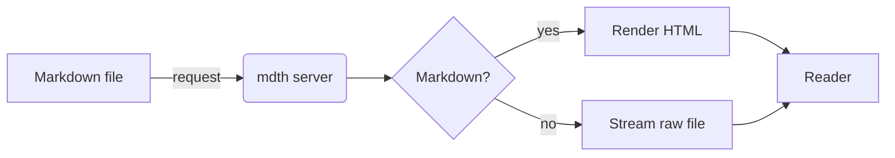
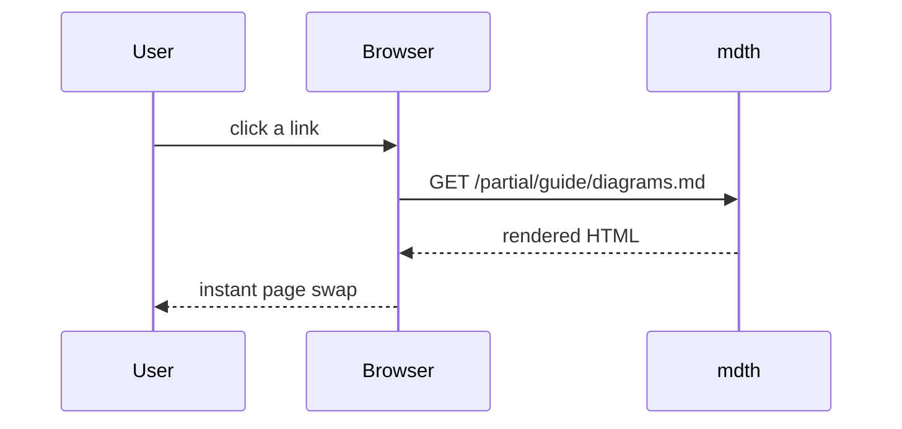

# Diagrams with Mermaid

Fenced `mermaid` blocks render as diagrams in the browser.

## Flowchart

## Sequence

Switch between light and dark mode — the diagrams re-render to match.

Back to [getting started](getting-started.md).
